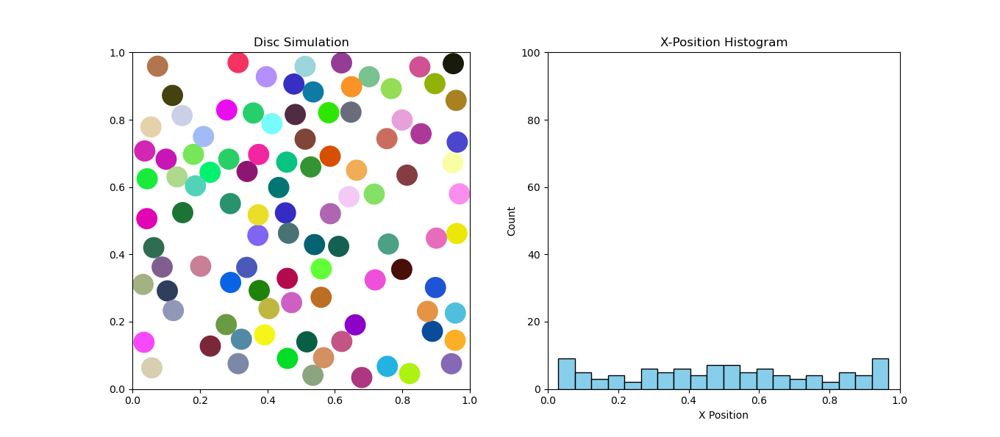

# Ejemplo de Uso: Simulación de Colisiones de Discos

##  Ejecución del proyecto
Para iniciar la simulación, ejecute el archivo **main.py** en su editor de codigo de preferencia o directamente en la terminal de bash.

Esto lanzará una simulación con parametros predeterminados mostrando:
- Ventana con animación de discos en movimiento
- Histograma de distribución sobre el eje X

## Parámetros modificables
En `main.py` se pueden ajustar los siguientes valores para experimentar diferentes simulaciones:

```python
# Configuración principal (líneas 10-13)
cantidad_discos = 50       # Valores recomendados: 5-100
radio_disco = 0.05         # Debe ser < 0.5 por los márgenes de la caja
dt = 0.01                  # Paso temporal 
frames = 500               # Duración de simulación (línea 68)
```

### Ejemplo práctico:
```python
cantidad_discos = 100
radio_disco = 0.03
```
**Comportamiento esperado**




